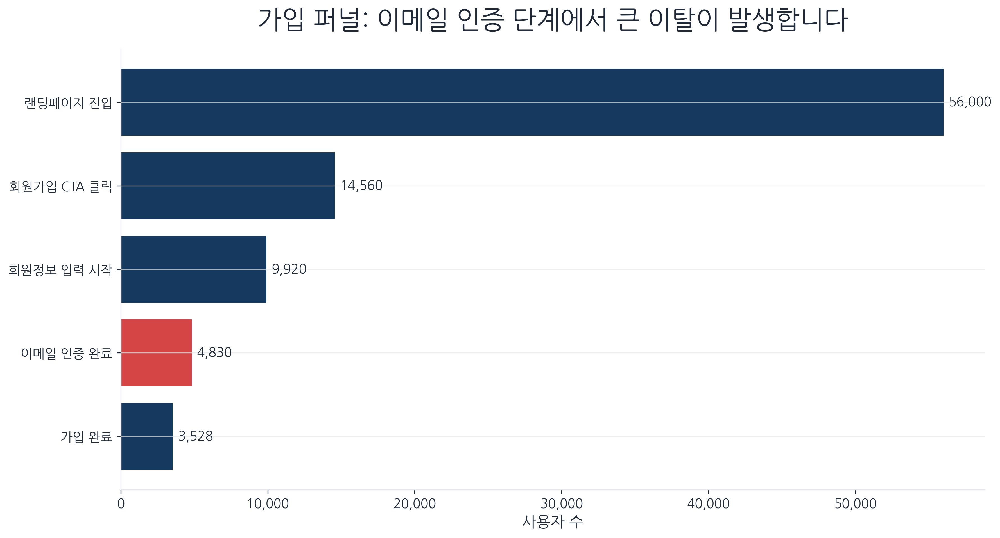
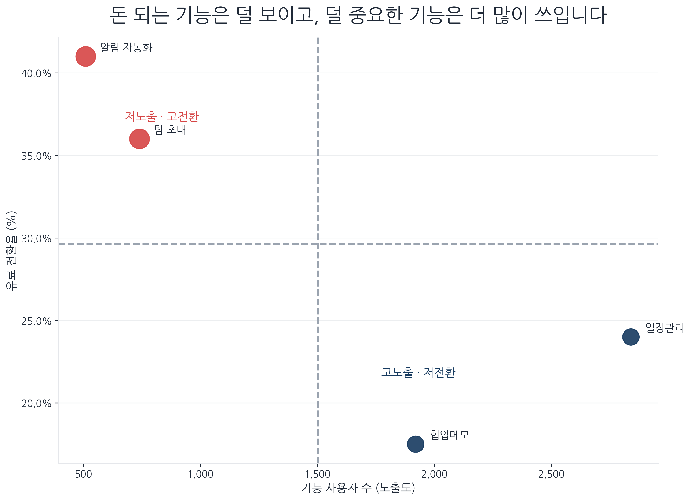
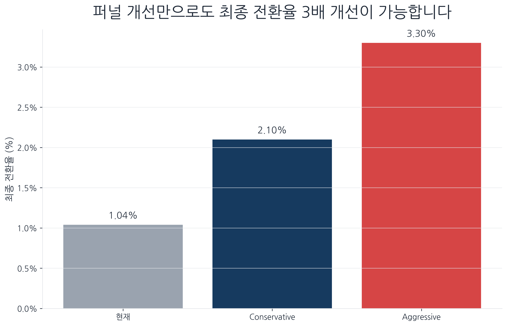
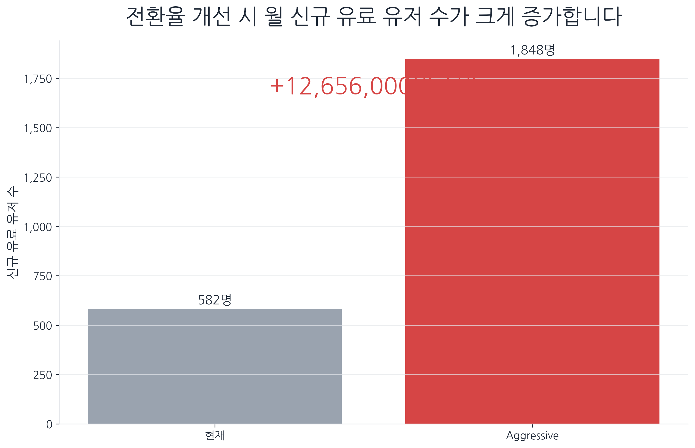

# 🚀 NextWave 데이터 분석: KPI 저하 원인 진단 및 PLG 개선 전략


## 📌 1. Project Overview (프로젝트 개요)
- **배경:** 생산성 SaaS 'NextWave'의 MAU(월간 활성 사용자)는 지속적으로 성장 중이나, **최종 결제 전환율은 1.87%에서 1.04%로 역성장**하는 구조적 디커플링 발생.
- **목표:** 단순 마케팅 채널의 문제가 아닌 '제품 내 경험(Activation)'의 병목을 데이터로 진단하고, 지속 가능한 성장을 위한 **Product-Led Growth(PLG) 기반의 프로덕트 개선 전략** 도출.
- **기대 효과:** 가입 퍼널 최적화 및 온보딩 개편을 통해 **최종 전환율 3.30%(약 3배) 개선 및 월 신규 MRR 최대 1,700만 원 추가 확보** 전망.

---

## 🔍 2. Key Findings (데이터 기반 문제 진단)

### ① 트래픽과 전환율의 디커플링 (Acquisition vs Activation)
트래픽은 증가하나 전환율은 하락합니다. 이는 외부 마케팅이 아닌 내부 파이프라인의 붕괴를 시사합니다.
<p align="center">
  
</p>

### ② 가입 퍼널의 대규모 출혈 (Funnel Drop-off)
고객이 서비스의 가치를 경험하기도 전에 이탈하고 있습니다. 특히 **회원가입 CTA 클릭 직후(74%)**와 **이메일 인증 단계(51%)**에서 가장 치명적인 이탈이 발생합니다.
<p align="center">
  
</p>

### ③ 기능 노출도와 전환율의 불일치 (Feature-Value Mismatch)
유료 전환율이 가장 높은 **'알림 자동화(41.0%)'와 '팀 초대(36.0%)' 기능은 정작 사용자들이 발견하지 못하고 있습니다.** 반대로 전환 타율이 낮은 단순 일정관리 기능에 트래픽이 몰려 있습니다.
<p align="center">
  
</p>

---

## 💡 3. Actionable Insights (해결 전략 제안)

마케팅 예산을 태워 억지로 고객을 데려오는 대신, 제품 자체가 성장을 견인하는 **PLG 전략**을 제안합니다.

* **Action 1. 가입 퍼널 최소화 (SSO 도입):** 51%의 이탈을 유발하는 복잡한 이메일 인증 구간을 제거하고, Google/Apple 등 소셜 로그인(SSO)을 연동하여 가입 완료 도달률 개선.
* **Action 2. 온보딩 Default Path 개편 (TTV 단축):** 신규 가입 직후, 전환율이 가장 높은 **'팀 초대' 및 '자동화 기능'** 화면을 강제 노출하여 가치 도달 시간(Time-to-Value)을 최소화.
* **Action 3. 마일스톤 리워드 도입:** 전환율 0.70%에 불과한 SNS 광고 예산을 삭감하고, 해당 비용으로 팀원 3명 초대 시 프리미엄 기능을 제공하는 리워드 시스템 구축 (자발적 바이럴 유도).

---

## 📈 4. Business Impact (개선 시뮬레이션)

퍼널의 각 단계를 소폭 개선하는 것만으로도 복리 효과(Compound Effect)를 통해 **최종 전환율을 3배 이상(3.30%) 끌어올릴 수 있습니다.**
<p align="center">
  
</p>

이를 통해 외부 트래픽 추가 유입 없이도, 월 신규 유료 유저를 1,848명으로 늘려 **월 1,200만 원 이상의 추가 MRR 확보가 가능**합니다.
<p align="center">
  
</p>

---

## 📂 5. Repository Structure
본 레포지토리는 분석의 재현성(Reproducibility)을 위해 아래와 같이 구성되었습니다.
```text
├── data/       # 분석에 사용된 원본 데이터셋 (Funnel, Segment, Feature logs 등)
├── scripts/    # 데이터 추출 및 EDA를 위한 분석 코드 (Python, SQL)
│   ├── analysis.py
│   └── queries.sql
├── output/     # 파이썬 코드를 통해 생성된 핵심 시각화 그래프
└── README.md   # 분석 결과 및 비즈니스 임팩트 요약
